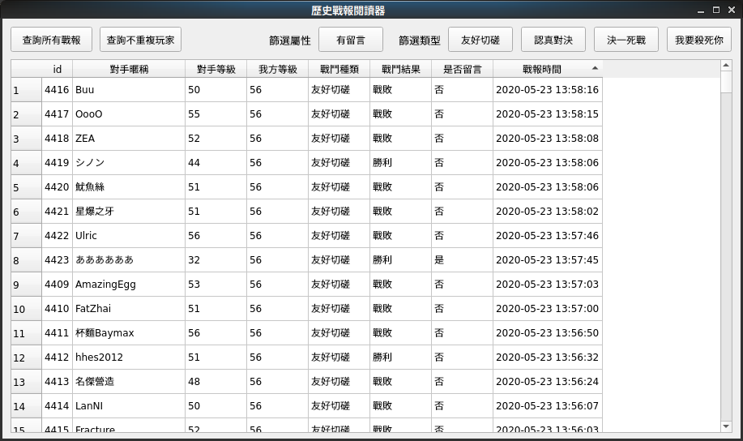
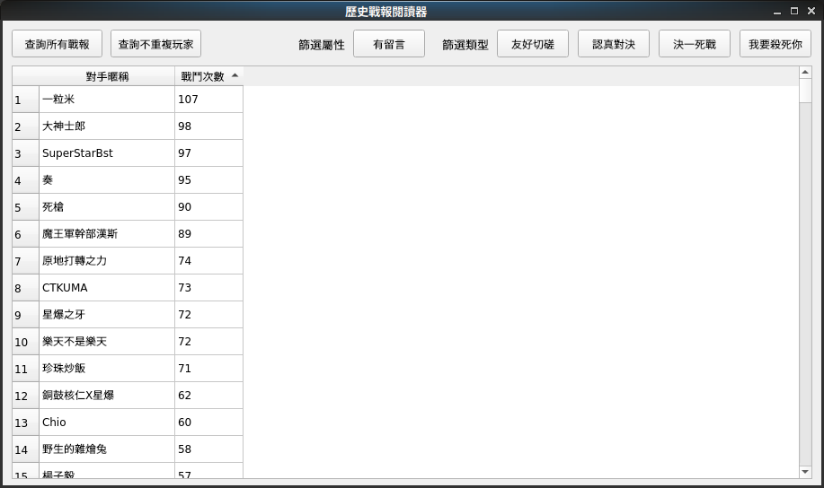
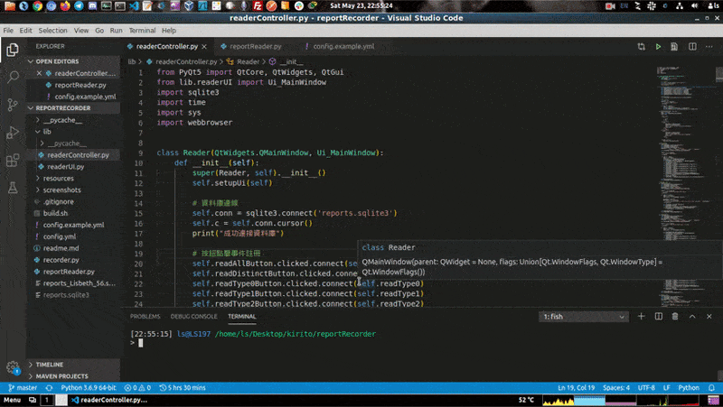
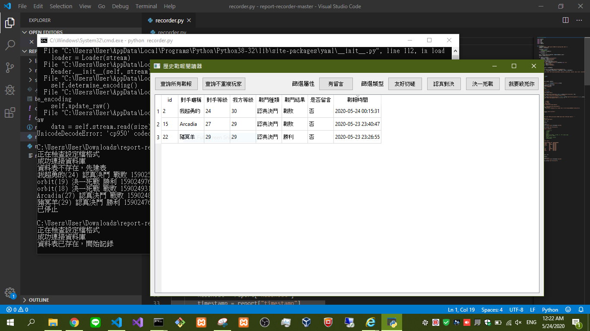

# 戰報記錄器

這是爲了給經驗包們方便看戰報的工具  
說不定有人有留言給你但沒幾分鐘就被洗掉了  
或許有人趁亂跟你決一死戰但沒幾分鐘就被洗掉了  
如果真有人趁亂  
那這種人真的欠公審

夕鶴

***

### 需求

* Python3
* sqlite
* PyQt5 (`pip install pyqt5`)
* requests (`pip install requests`)
* yaml (`pip install pyyaml`)

### 事前準備

把 `config.example.yml` 複製一份成 `config.yml`，並填入 `token` 

### 開始記錄

```bash
python recorder.py
```

如果 `config.yml` 設定無誤，那就會開始定時記錄。  
預設累積 20 次錯誤會自動關閉程式。

### 查閱戰報

```bash
python reportReader.py
```

必須先執行過上面的 `recorder.py` 再執行這個，否則會報錯。

### 一些截圖

#### 查詢所有已記錄戰報


#### 查詢不重複玩家


#### 細項

點擊暱稱與戰報時間會自動開啓連結
點擊欄位名稱能改變排序



#### 在 Windows 上也能執行
